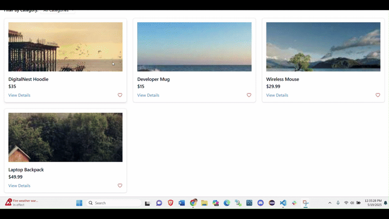

# 🛍️ React E-Commerce Mini App

This is a simple e-commerce frontend built using **React** and **React Router**. It features:
- A product listing page
- Favorite (❤️) functionality with animation
- Cart management 
- Detail view for each product
- Dark & Light Mode

---

## 📁 Project Structure
```
src/
│
├── components/ # Reusable UI components
│ ├── Cart.js # Cart component with its logic
│ ├── Favorite.js # Favorite icon component component with its logic
│ ├── Navbar.js # Navigation bar with links to pages
│ ├── ProductCard.js # Individual product card with image, price, and favorite icon
│ ├── ProductDetail.js # Component to show full product details
│ ├── ProductList.js # Displays all products as cards
│
├── context/ # Context API logic
│ ├── CartContext.js # Manages cart state and dispatch actions
│ ├── FavoriteContext.js # Manages favorite products using useReducer
│
├── pages/ # Route-level components (views)
│ ├── CartPage.js # Displays cart contents
│ ├── FavoritesPage.js # Displays all favorited products
│ ├── Home.js # Main home page showing the product list
│ ├── ProductDetailPage.js# Route-based wrapper around ProductDetail.js
│
├── App.js # Main app component with routes and layout
├── App.css 
├── index.js # React entry point
├── index.css 
└── logo.svg 
```
## 📌 My Approach

### 🌙 Dark Mode Support with Tailwind CSS
I implemented dark mode using Tailwind CSS's `dark:` variants. Tailwind provides utility-first classes that make theme switching efficient and intuitive, without writing custom CSS or adding external theming libraries.

### 🔄 Global State Management with Context API
I used React's built-in Context API to manage global state for the cart and favorites. This eliminates the need for external libraries like Redux, keeping the application lightweight and easy to maintain while still allowing consistent state sharing across components.

### 🧩 Component-Based Architecture
The application is broken into reusable components such as `ProductCard`, `Navbar`, `ProductList`, etc. This promotes code reusability, readability, and scalability, making it easy to add new features in the future.

### ⚡ API Integration with Axios
I used Axios to handle API requests due to its simplicity, promise-based API, and built-in error handling. It offers a more developer-friendly interface compared to the native `fetch` API.

### 📱 Responsive Design with Tailwind CSS Grid
Tailwind's responsive utility classes allow the UI to adjust seamlessly across different screen sizes using grid layouts. This ensures a smooth user experience on both mobile and desktop devices.

### 🧭 Navigation with React Router
React Router enables smooth, client-side routing for pages like Home, Product Details, Cart, and Favorites without full page reloads, preserving the SPA (Single Page Application) behavior.


## ✨ Features Implemented

- ✅ Product listing with image, name, and price
- ✅ Filter option for the products
- ✅ Product detail view with more info
- ✅ Add/Remove favorites (❤️) with icon animation
- ✅ Context API for global state (favorites & cart)
- ✅ Navigation across Home, Cart, Favorites, and Detail pages
- ✅ Quantity selectors (e.g., + / – buttons) in the Cart
- ✅ Total price calculation of the products in the Cart
- ✅ Dark and Light Mode

### ❤️ Future Improvements
- Persist favorites using `localStorage`
- Sync favorites with backend (user-based)
- Pagination or infinite scroll
- Add loading spinners or skeletons (UI/UX Enhancements)
- Add login/signup pages ( Authentication)
- Store user-specific cart/favorites in backend ( Authentication)

## 🛠️ Tech Stack

- **React** (Functional components)
- **React Router DOM**
- **Context API + useReducer**
- **Tailwind CSS** (used for styling)
- **Heroicons** for icons

## Problem Faced & Solutions
1. "No routes matched location '/ecommerce/'" error
Problem: After deployment, I got a blank page with this error because React Router couldn’t match the route.
Solution: I fixed this by setting a basename in BrowserRouter

